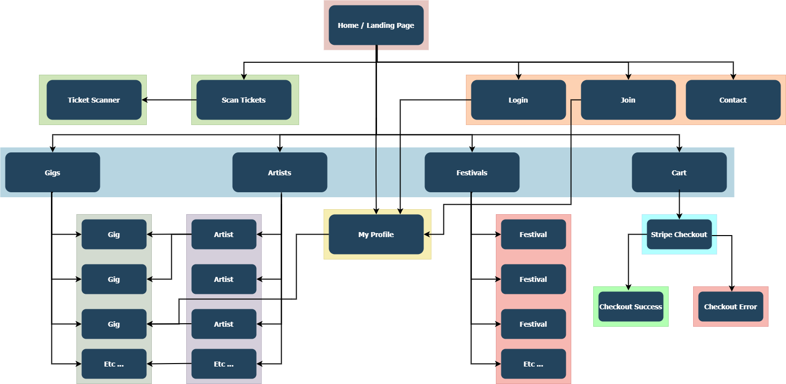

# Views Documentation

## Public & General
- **components:** Renders a UI components showroom.
- **index:** Displays the homepage using CMS content (e.g., just announced gigs, featured gigs, artist of the week).
- **artists_view:** Lists all artists.
- **gigs:** Lists all gigs.
- **gig:** Shows gig details (including ticket stats).
- **festival / festivals:** Lists festivals and displays festival details.
- **contact:** Renders the contact form with rate limiting.
- **password_change:** Displays the password change form.

## Artist & Registration
- **register:** Manages user registration; creates an artist profile if needed.
- **artist_view:** Displays an artist’s profile (includes top track and genre options).
- **create_gig:** Enables an artist to create a gig using address, venue, and gig forms.
- **login_redirect_view:** Redirects users after login based on their role.
- **approve_artist:** Toggles artist approval status.
- **upload_profile_picture:** Updates the artist's profile picture via AJAX.
- **update_text:** Allows artists to update profile text.
- **add_genre:** Adds a genre tag to an artist.
- **add_social_link / delete_social_link / remove_social_link:** Manage artist social media links.
- **logout_view / admin_logout_view:** Handles user logout.

## Shopping Cart & Checkout
- **cart:** Manages cart actions (add, update, remove gigs) with validations.
- **checkout:** Creates a Stripe checkout session for cart items.
- **checkout_completed:** Renders the confirmation page and clears the cart.

## Payment & Webhook
- **stripe_webhook:** Processes incoming Stripe webhook events.

## Ticket Scanning
- **scan_tickets:** Lists gigs for ticket scanning (artist-only access).
- **ticket_scanner:** Renders a page to scan tickets for a specific gig.
- **scan_ticket_api:** Validates and marks a ticket as used via API.

## Artist Support
- **support_artist_gig:** Sends credit support from one artist to another.
- **accept_support / reject_support:** Manage incoming support transactions, adjusting credits accordingly.

## Administrative Tools
- **close_gig:** Toggles a gig's closed status (staff only).
- **export_gig_tickets:** Exports gig tickets to CSV (staff only).

## Helper
- **social_link_validation:** Validates social link URLs using regex.

# Website Flowchart Diagram

